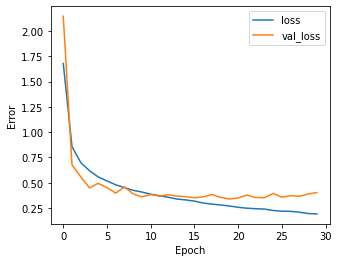

<h1 align="center">
   
  <a href="https://github.com/fparisio/DataScience">
   
</h1>

<h4 align="center">Data Science and Machine Learning Projects, <a href="https://www.linkedin.com/in/francesco-parisio-b1b53844/" target="blank"> by Francesco Parisio</a></h4>

  

### About

The repository contains a series of data science and machine learning projects that I carried out. The content is divided into subcategories and each project is implemented as either *[jupyter notebook](https://jupyter.org/)* or a *[python](https://www.python.org/)* script.

### Table of Contents

I have divided the projects into macro-categories based on the typology of the problem at hand.

- [Time series forecasting of CO2 emissions](#time-series-forecasting-of-CO2-emissions)
- [Recommendation system for Amazon products](#recommendation-system-for-Amazon-products)
- [Convolutional neural networks to recognize digits](#convolutional-neural-networks-to-recognize-digits)

---
#### *[Time series forecasting of CO2 emissions](https://github.com/fparisio/DataScience/tree/main/TimeSeriesCO2ForecastNatGas)*

**Summary**: This project forecasts a 1-year increase of 6.7% in CO2 emissions from natural gas-based electricity production in the United States using an optimized and cross-validated SARIMAX model, with an uncertainty of about 10%. The model's reliability and robustness are demonstrated by a Symmetric Mean Absolute Percentage Error (SMAPE) below 3% on testing data and a cross-validation showing 75% of forecasts with a SMAPE less than 15%. These forecasts can inform policymakers on the need for stronger measures to reduce CO2 emissions.

**Tools**: Python, Statsmodels, Pandas, Numpy, Matplotlib, Itertools, Tqdm, Scipy, Seaborn, SARIMAX, Time Series Analysis, Rolling-split Validation,  Monte Carlo Simulations.

---
#### *[Recommendation system for Amazon products](https://github.com/fparisio/DataScience/tree/main/RecommendationSystem)*

**Summary**: I developed a series of recommendation systems for Amazon products using collaborative filtering, matrix factorization, and optimization techniques to achieve a minimum precision of 85%. The collaborative filtering models use cosine similarity and KNN for user-user or item-item approaches, while the matrix factorization model employs the SVD algorithm. Each model's performance is evaluated and optimized using precision, recall, and F1 score metrics, with the user-user and SVD models achieving the best results.

**Tools**: Python, Collections, Surprise, Scikit-leanr, Pandas, Numpy, Matplotlib, Recommendation Systems, Collaborative Filtering, KNN, SVD.

---
#### *[Customer churn prediction](https://github.com/fparisio/mlops_churn/tree/main)*

**Summary**: I constructed a machine learning pipeline that automates exploratory data analysis (EDA) and trains two predictive models (Random Forest and Logistic Regression) to forecast customer churn. The code quality is ensured through linting, formatting, and pre-commit githooks verification. This project serves as an example of best practices in MLOps.

**Tools**: Python, Scikit-learn, Pandas, Numpy, Matplotlib, Pytest, Pylint, Black.

---
#### *[Convolutional neural networks to recognize digits](https://github.com/fparisio/DataScience/tree/main/DigitRecognition)*

**Summary**: I developed a convolutional neural network (CNN) to identify housing number digits using the Street View Housing Numbers (SVHN) image dataset. By incorporating additional convolutional layers, batch normalization, and dropout, the model achieved over 90% accuracy. This deep learning approach effectively recognizes digits from labeled image databases, demonstrating the versatility of CNNs in image recognition tasks.

**Tools**: Python, Scikit-learn, Pandas, Numpy, Matplotlib, TensorFlow, Keras, Artificial Neural Networks, Convolutional Neural Networks, Image Recognition.

