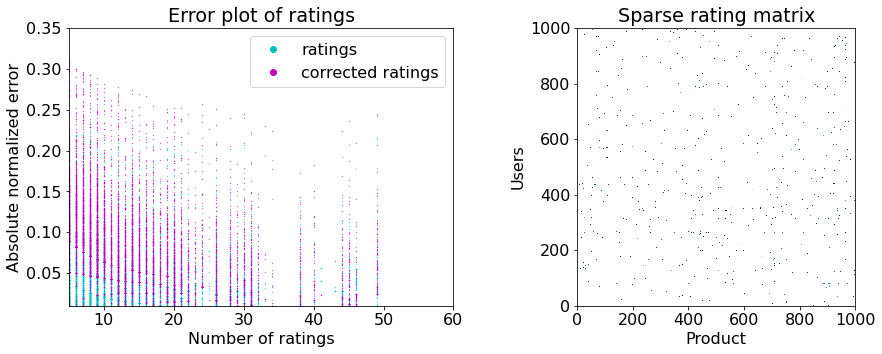

<h1 align="center">
   
  <a href="https://github.com/fparisio/DataScience">
   
</h1>

<h4 align="center">Data Science and Machine Learning Projects, <a href="https://www.linkedin.com/in/francesco-parisio-b1b53844/" target="blank"> by Francesco Parisio</a></h4>

  

### About

The repository contains a series of data science and machine learning projects that I carried out for training, academic and applied research purposes. The content is divided into subcategories and each project is implemented as either *[jupyter notebook](https://jupyter.org/)* or a *[python](https://www.python.org/)* script.

### Table of Contents

I have divided the projects into macro-categories based on the typology of the problem at hand.

- [Time series forecasting of CO2 emissions](#Time-series)
- [Recommendation system for Amazon products](#Rec-sys)
- [Convolutional neural networks to recognize digits](#CNN)

---
#### *[Time series forecasting of CO2 emissions](https://github.com/fparisio/DataScience/tree/main/TimeSeriesCO2ForecastNatGas)*

**TL; DR**: The project forecasts a 1 year horizon of CO2 emissions stemming from natural gas based electricity production in the United States. Through an optimized and cross-validated SARIMAX model, I predict a 6.7% increase of emitted CO2 in the 1 year horizon with an uncertainty of approx. 10%.

**Executive Summary**: Precise and accurate forecasts of CO2 emissions can help policy makers devise strategies and measure their effects in reducing emissions to meet the climate targets. Here, I have analyzed CO2 emissions from electricity production employing natural gas. I compare different algorithms (AR, MA, ARMA, ARIMA, SARIMAX) optimized to build a reliable forecast at 1 year horizon. I applied rolling split Monte Carlo cross-validation to evaluate the forecast accuracy. The optimized SARIMAX model is the best solution that strikes a balance between forecast precision and model complexity. The Symmetric Mean Absolute Percentage Error (SMAPE) on testing data is below 3%. The cross-validation shows an (expected) increasing average error with the forecasting horizon. The average error remains below 11% and roughly 75% of the forecasts are likely to have a SMAPE&lt;15%–a proof of the model’s reliability and robustness. The model predicts that CO2 emissions will increase and will do so at an increased pace compared to the previous 10 years. The indication for policy maker is clear: we should rapidly take stronger measures to reduce CO2 emissions.

**Skills**: Python, Statsmodels, Pandas, Numpy, Matplotlib, Itertools, Tqdm, Scipy, Seaborn, SARIMAX, Time Series Analysis, Rolling-split Validation,  Monte Carlo Simulations.

---
#### *[Recommendation system for Amazon products](https://github.com/fparisio/DataScience/tree/main/RecommendationSystem)*

**TL; DR**: The project goal is to recommend the best amazon products available to the users by using some recommendation systems techniques.

**Executive Summary**: TBW

**Skills**: Python, Collections, Surprise, Scikit-leanr, Pandas, Numpy, Matplotlib, Recommendation Systems, SVD.

---
#### *[Convolutional neural networks to recognize digits](https://github.com/fparisio/DataScience/tree/main/RecommendationSystem)*

**TL; DR**: TBW

**Executive Summary**: TBW

**Skills**: Python, Scikit-learn, Pandas, Numpy, Matplotlib, TensorFlow, Keras, Artificial Neural Networks, Convolutional Neural Networks, Image Recognition.

